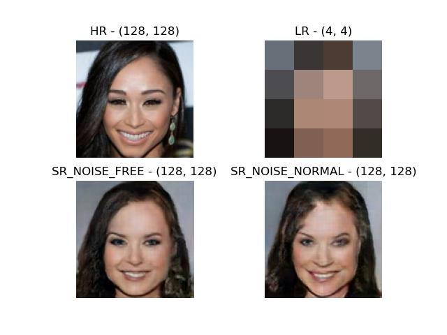

# LAG-TF2

Unofficial TF2 Implementation for the paper: "[Creating High Resolution Images with a Latent Adversarial Generator](https://arxiv.org/abs/2003.02365)"
by David Berthelot, Peyman Milanfar, and Ian Goodfellow.

The official TF1 implementation was used as reference https://github.com/google-research/lag/

Another Unofficial Pytorch Implementation could be found at https://github.com/mmathew23/LAG-Pytorch
by [mmathew23](https://github.com/mmathew23).

## Training a model

1. Put your training data into the "./datasets" directory.
2. Write the "./records.json" file according to your own directory name.
3. Run the following command: ```python lag.py```

## Presentation


